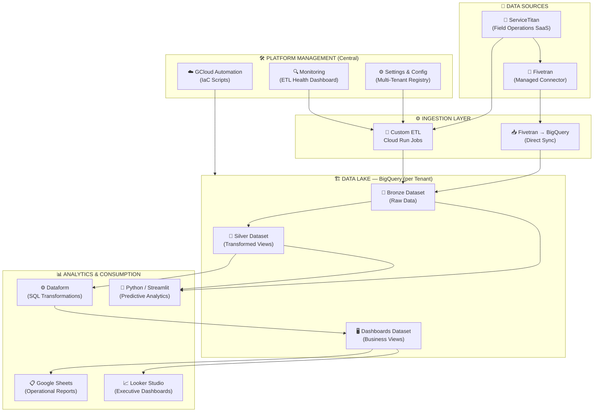
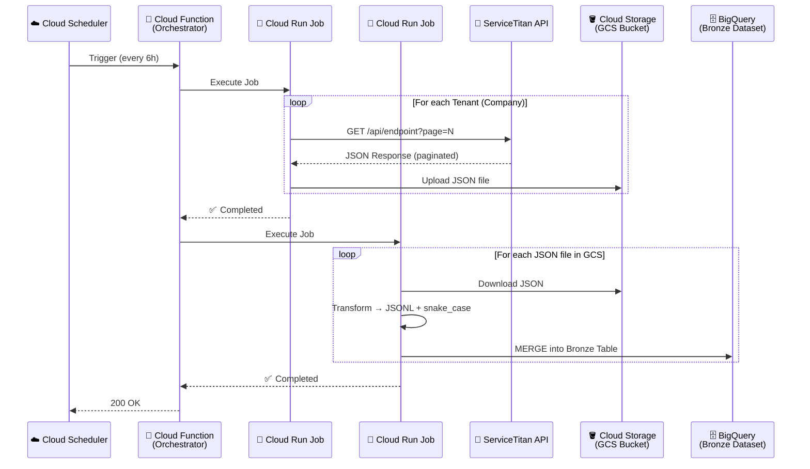
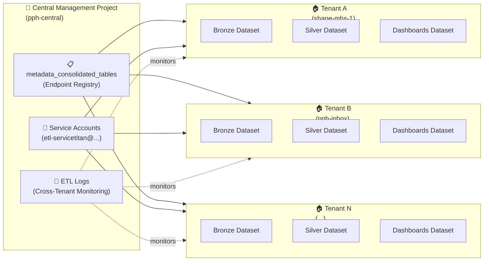
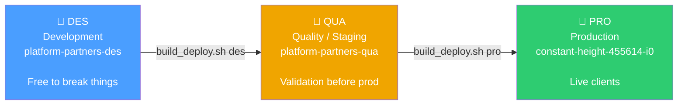
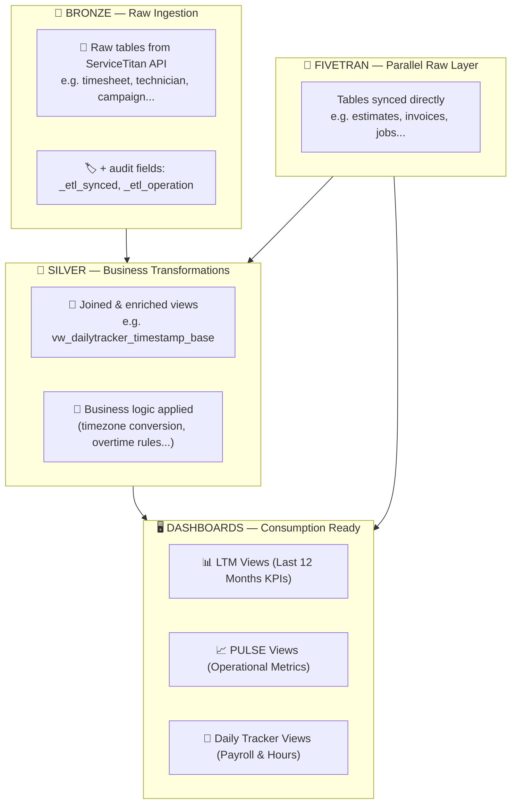
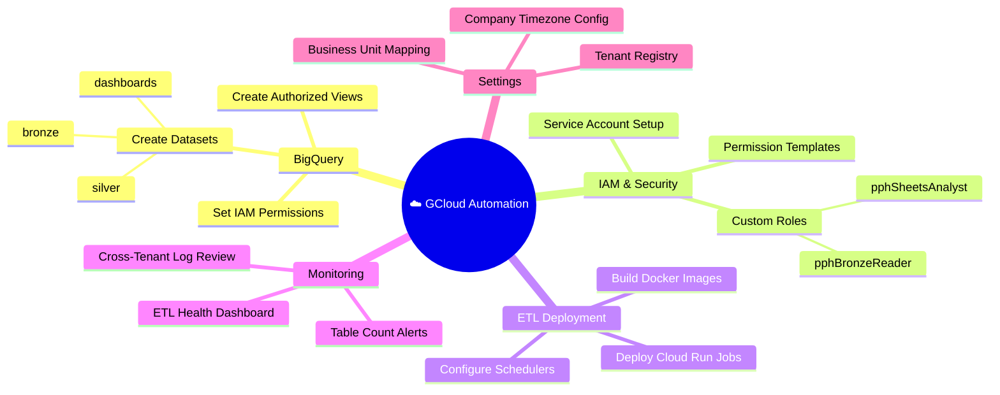
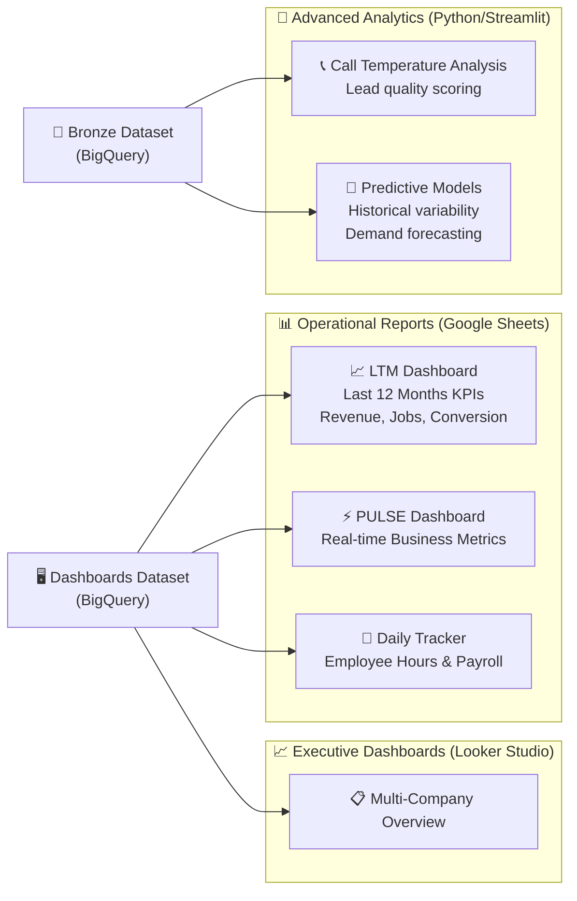
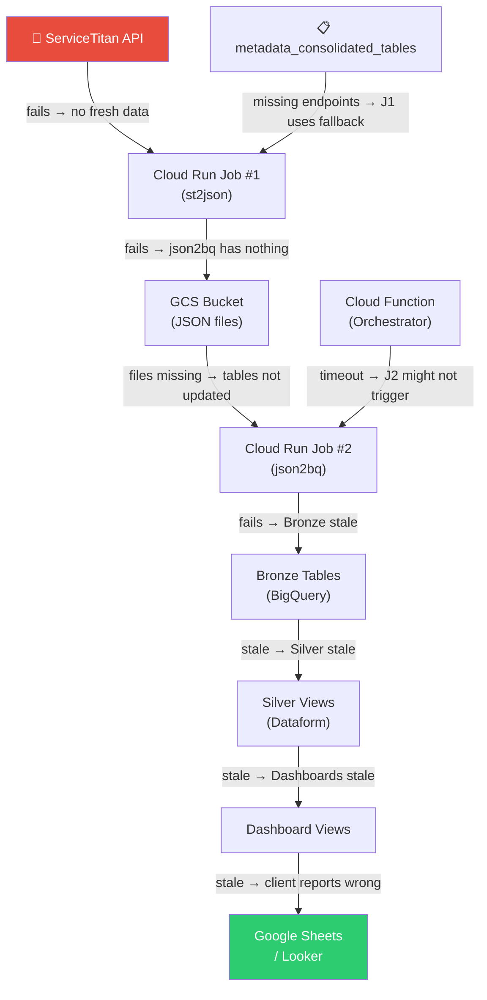

# 📐 Architectural Atlas
## Platform Partners — ServiceTitan Data Platform

> **Purpose:** This document provides a complete visual map of the Data Platform. It is structured from a high-level executive overview down to technical implementation detail. It serves as the single source of truth for understanding, maintaining, and replicating the platform.

---

## 1. 🗺️ High-Level System Overview

This is the "30,000 ft view" — the entire platform in one diagram.

---

## 2. ⚙️ ETL Deep-Dive: Data Extraction Pipeline

This diagram shows the exact internal orchestration of the custom ETL process from source API to BigQuery.

**Key behaviors:**
- 🔁 **Incremental MERGE:** Only inserts/updates changed records, never full reloads
- 🏷️ **Audit Fields:** Every record gets `_etl_synced` (timestamp) and `_etl_operation` (INSERT/UPDATE/DELETE)
- 🧹 **Soft Delete:** Deleted records are flagged, never physically removed

---

## 3. 🏢 Multi-Tenant Architecture

Each client company is a fully isolated tenant with its own GCP project and BigQuery datasets.

> [!IMPORTANT]
> The `pph-central` project is the control tower. All automation, IAM policies, and metadata configurations are managed from here and pushed out to each tenant project.

---

## 4. 🌎 Multi-Environment (SDLC) Structure

Changes flow through 3 environments before reaching clients, ensuring stability.

**Deployment automation:** Each environment has its own Cloud Run Jobs, schedulers, and service accounts. Promotion between environments is a single shell command (`build_deploy.sh [env]`).

---

## 5. 🗄️ Data Layer Architecture (Medallion)

Data quality and readiness increases as it moves through each layer.

---

## 6. 🛠️ Platform Management: Automation Capabilities

The platform includes a full suite of automation scripts (Infrastructure as Code) for deploying to new tenants.

---

## 7. 📊 Analytics & Products Built on the Platform

What do clients actually get? These are the visible outputs.

---

## 8. 🔄 Platform Component Dependency Map

*For maintenance: know what breaks if one component fails.*

> [!WARNING]
> The highest-risk single point of failure is **Cloud Function timeout**. If the orchestrator times out between Job 1 and Job 2, the pipeline is only half-executed with no automatic recovery. This is addressed in the Technical Debt plan.

---

*Last updated: March 10, 2026 — Platform Partners Data Team*
