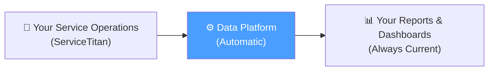

# 📋 Product Catalog
## Platform Partners — Data Intelligence Platform

> **Who is this for?** Business owners, operations leaders, and executives who want to understand the value of their data platform — without needing to be technical.

---

## What Is This Platform?

Your data platform is the **intelligence layer** that sits between your field operations software (ServiceTitan) and the business decisions you make every day.

It automatically collects, organizes, and delivers data so that you and your team always have **accurate, up-to-date information** — without manual exports, spreadsheet errors, or data delays.

---

## 📦 What's Included: The Product Suite

### 1. 📈 LTM — Last Twelve Months Dashboard
**"Your business at a glance, across an entire year."**

| Feature | Business Value |
|---|---|
| 12-month rolling KPIs | See trends, not just snapshots |
| Revenue & job conversion metrics | Know which business units perform best |
| Multi-company view | Manage the whole holding from one place |
| Automatically refreshed | No manual data pull, ever |

> *Powered by: BigQuery Silver & Dashboards datasets + Google Sheets connector*

---

### 2. ⚡ PULSE — Real-Time Operational Metrics
**"Know what's happening right now in your business."**

| Feature | Business Value |
|---|---|
| Business unit performance | Identify top performers and laggards instantly |
| Campaign & lead tracking | Know which marketing efforts drive revenue |
| Job type breakdown | See where your technicians spend their time |
| Daily & weekly summaries | Make decisions based on today, not last month |

> *Powered by: Fivetran sync + Silver views + Google Sheets*

---

### 3. 📅 Daily Tracker — Payroll & Hours Intelligence
**"Eliminate payroll guesswork. Know exactly what every employee worked."**

| Feature | Business Value |
|---|---|
| Automatic hours calculation | Technician job hours, idle time, driving time |
| Overtime & Double OT detection | California labor law compliance built-in |
| Paid Time Off tracking | All timesheet codes categorized automatically |
| Per-employee daily breakdown | Transparency for your HR and payroll team |

> *Powered by: ServiceTitan Timesheets API + BigQuery transformations*

---

### 4. 🧠 Predictive Analytics — Know What's Coming
**"Stop reacting. Start anticipating."**

| Feature | Business Value |
|---|---|
| Call temperature scoring | Predict which incoming leads are hot before they book |
| Historical variability analysis | Know your slow seasons before they arrive |
| Demand forecasting | Staff and stock inventory proactively |
| Box-plot trend models | Statistical proof behind your business intuition |

> *Powered by: Python / Streamlit models running on BigQuery data*

---

## 🛡️ Platform Capabilities — The "Behind the Scenes" Guarantees

These aren't just features — they're the foundation that makes everything above reliable.

---

### ✅ Data Reliability & Audit Trail
Every single record in your data warehouse has a full history:

- **When** it was synced
- **What** happened to it (created, updated, or deleted)
- **Nothing is ever lost** — even deleted records are preserved as historical reference

*Technical term: Soft Delete + Audit Fields (`_etl_synced`, `_etl_operation`)*

---

### 🔒 Company Data Isolation (Multi-Tenant Security)
Each company in your portfolio has its own **completely separate** data environment.

- Company A's data **cannot** be seen by Company B
- Each tenant has its own Google Cloud project and datasets
- Service accounts are scoped per company

*This means: you can safely add new companies without any risk of data contamination.*

---

### 🔄 Automatic Data Synchronization
Your data is refreshed **every 6 hours**, automatically, 24/7.

- No manual exports from ServiceTitan
- No human error in copy-paste operations
- If a sync fails, the system logs the failure and retries

---

### 🌎 Multi-Environment Safety Net
Every change to the platform goes through 3 stages before reaching your live data:

1. **Development** — We test changes safely
2. **Staging** — We validate with real data structure
3. **Production** — Only stable, tested changes reach your dashboards

*This means: updates to your platform will never break your reports unexpectedly.*

---

### 📡 Dual Data Source Coverage
Your platform connects to ServiceTitan in two complementary ways:

| Source | Best For |
|---|---|
| **Custom ETL** (our engine) | Real-time operational data: timesheets, technicians, campaigns |
| **Fivetran** (managed connector) | Deep historical data: estimates, invoices, jobs at scale |

Together, they give you **complete coverage** of your ServiceTitan data — nothing is left out.

---

### 🧩 Self-Service Reporting via Google Sheets
Your team doesn't need to be a data engineer to use the platform.

- Reports are delivered directly to **Google Sheets** — familiar and fast
- Data refreshes automatically via **BigQuery Connected Sheets**
- Sheets can be customized, filtered, and shared like any normal spreadsheet

---

## 📈 Value Summary

| Challenge You Had | How the Platform Solves It |
|---|---|
| Manually exporting data from ServiceTitan | ❌ Eliminated — automatic sync every 6h |
| Spreadsheets crashing from too much data | ❌ Eliminated — BigQuery handles millions of rows |
| Not knowing if data is current | ❌ Eliminated — every record has a sync timestamp |
| Risk of losing historical records | ❌ Eliminated — Soft Delete preserves everything |
| Adding a new company takes weeks | ✅ Reduced — automated onboarding in hours |
| Reports breaking after ServiceTitan updates | ✅ Managed — schema drift detection built-in |
| One manager needs data for 5+ companies | ✅ Enabled — multi-tenant consolidated views |

---

## 🏢 Who Uses This Platform?

| Role | What They Get |
|---|---|
| **Business Owner / CEO** | Executive dashboard with multi-company KPIs |
| **Operations Manager** | Daily Tracker — hours, overtime, team performance |
| **Marketing Lead** | Campaign effectiveness and lead conversion data |
| **HR / Payroll** | Accurate, automated timesheet summaries |
| **Finance** | Revenue trends, job profitability, historical comparisons |

---

*Platform Partners Data Intelligence Platform — Built on Google Cloud & ServiceTitan*
*Last updated: March 10, 2026*
