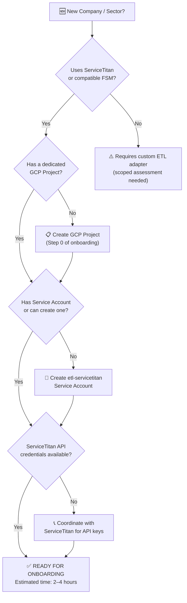

# 🗺️ Scalability Blueprint
## Replicating the Data Platform: New Companies & New Sectors

> **Purpose:** This document is the "franchise manual" for the Data Platform. It answers the question: *"How do we take what we've built for one company and deploy it for a new one — in hours, not months?"*

---

## Part 1: Fit Assessment — Is a New Company Ready?

Before onboarding any new tenant, assess these four dimensions.



---

## Part 2: Sector Applicability Map

The platform is built on ServiceTitan data, which serves many field service industries.

| Sector | ServiceTitan Used? | Platform Ready? | Notes |
|---|---|---|---|
| 🛠️ HVAC | ✅ Yes | ✅ Yes | Native fit, same endpoints |
| 🔧 Plumbing | ✅ Yes | ✅ Yes | Native fit |
| ⚡ Electrical | ✅ Yes | ✅ Yes | Native fit |
| 🌿 Landscaping | ✅ Yes | ✅ Yes | Minor tweaks to job types |
| 🐛 Pest Control | ✅ Yes | ✅ Yes | Recurring jobs pattern differs |
| 🏗️ General Contracting | ⚠️ Partial | 🔄 Adaptable | Estimates-heavy, adjustments needed |
| 🏥 Non-FSM Industries | ❌ No | 🔬 Custom | Requires new ETL adapter |

---

## Part 3: New Tenant Onboarding Checklist

### Phase 0 — Prerequisites (One-time setup)
```
[ ] GCP Project created for the new company
[ ] Project ID and Project Number documented
[ ] Billing account linked
[ ] ServiceTitan API credentials obtained:
    - app_id
    - client_id
    - client_secret
    - tenant_id
    - app_key
```

---

### Phase 1 — Infrastructure Setup (~30 min)

#### Step 1.1 — Create BigQuery Datasets
```bash
python gcloud_automation/create_bigquery_datasets.py \
  --project NEW_COMPANY_PROJECT_ID \
  --datasets bronze silver dashboards management
```
This creates 4 datasets with standardized naming and access controls.

#### Step 1.2 — Create & Configure Service Account
```bash
bash gcloud_automation/iam/create_pro_service_account.sh \
  --project NEW_COMPANY_PROJECT_ID
```
This creates `etl-servicetitan@NEW_COMPANY_PROJECT_ID.iam.gserviceaccount.com` with the correct roles:
- `roles/bigquery.admin` (BigQuery)
- `roles/storage.admin` (GCS buckets)
- `roles/run.invoker` (Cloud Run Jobs)

#### Step 1.3 — Grant Cross-Project Permissions
The Service Account also needs read access to `pph-central` to query the endpoint registry:
```bash
gcloud projects add-iam-policy-binding pph-central \
  --member="serviceAccount:etl-servicetitan@NEW_COMPANY_PROJECT_ID.iam.gserviceaccount.com" \
  --role="roles/bigquery.dataViewer"
```

---

### Phase 2 — ETL Deployment (~45 min)

#### Step 2.1 — Register the Tenant in the Metadata Registry
Add the new company to `pph-central.management.metadata_consolidated_tables`:
```sql
INSERT INTO `pph-central.management.metadata_consolidated_tables`
  (project_id, company_name, active, silver_use_bronze, endpoint, table_name)
VALUES
  ('NEW_COMPANY_PROJECT_ID', 'New Company Name', TRUE, TRUE, 
   STRUCT('settings', 'v2', NULL, 'technicians', 'normal'), 'technician'),
  -- ... (repeat for each endpoint)
```
> **Pro tip:** Use the existing company entry as a template and update `project_id` and `company_name`.

#### Step 2.2 — Deploy ETL Jobs
```bash
# Set the target project
gcloud config set project NEW_COMPANY_PROJECT_ID

# Deploy extraction job
cd etl_servicetitan/st2json-job
./build_deploy.sh pro

# Deploy load job
cd ../json2bq-job
./build_deploy.sh pro
```

#### Step 2.3 — Register ServiceTitan Credentials
Store in Google Secret Manager (recommended) or as environment variables in Cloud Run:
```bash
gcloud run jobs update etl-st2json-job \
  --project NEW_COMPANY_PROJECT_ID \
  --region us-east1 \
  --set-env-vars "ST_APP_ID=...,ST_CLIENT_ID=...,ST_TENANT_ID=..."
```

#### Step 2.4 — Configure the Scheduler
```bash
gcloud scheduler jobs create http etl-NEW_COMPANY-schedule \
  --location=us-east1 \
  --project NEW_COMPANY_PROJECT_ID \
  --schedule="0 */6 * * *" \
  --uri="ORCHESTRATOR_FUNCTION_URL" \
  --http-method=POST
```

---

### Phase 3 — Dataform & Analytics Setup (~30 min)

#### Step 3.1 — Add Company to Dataform Config
Edit `ltm_migration/dataform/includes/config_loader.js` to add the new company:
```javascript
const ACTIVE_COMPANIES = [
  // ... existing companies ...
  {
    project: "NEW_COMPANY_PROJECT_ID",
    name: "New Company Name",
    datasets: {
      raw: "bronze",
      silver: "silver",
      dashboards: "dashboards"
    }
  }
];
```

#### Step 3.2 — Run Dataform to Generate Views
```bash
dataform run --project NEW_COMPANY_PROJECT_ID
```
This auto-generates all `silver` and `dashboards` views for the new company.

#### Step 3.3 — Create Google Sheets Connections
For each report (LTM, PULSE, Daily Tracker):
1. Open the template Google Sheet
2. Go to **Data → Connected Sheets**
3. Point to `NEW_COMPANY_PROJECT_ID.dashboards.vw_[report_name]`
4. Set refresh schedule to daily

---

### Phase 4 — Validation (~30 min)

```bash
# Verify data is flowing into Bronze
bq query --nouse_legacy_sql \
  "SELECT COUNT(*) as records, MAX(_etl_synced) as last_sync 
   FROM \`NEW_COMPANY_PROJECT_ID.bronze.technician\`"

# Verify Silver views are populated
bq query --nouse_legacy_sql \
  "SELECT COUNT(*) FROM \`NEW_COMPANY_PROJECT_ID.silver.vw_dailytracker_timestamp_base\`"

# Verify Dashboards dataset
bq ls --project_id=NEW_COMPANY_PROJECT_ID dashboards
```

---

## Part 4: Time & Effort Estimate

```mermaid
gantt
    title New Tenant Onboarding — Timeline
    dateFormat HH:mm
    axisFormat %H:%M

    section Phase 0 (Prerequisites)
    Gather credentials & GCP setup  :a1, 00:00, 30m

    section Phase 1 (Infrastructure)
    Create datasets & service accounts :a2, after a1, 30m

    section Phase 2 (ETL)
    Register metadata & deploy jobs :a3, after a2, 45m

    section Phase 3 (Analytics)
    Dataform config & Sheets setup  :a4, after a3, 30m

    section Phase 4 (Validation)
    Test & verify end-to-end flow   :a5, after a4, 30m
```



**Total estimated time: 2–4 hours** for a team member familiar with the platform. First-time setup may take up to a day.

---

## Part 5: What Makes This Scalable? (The Pitch)

This section is for **presenting the platform to new prospective clients** — why this is a proven, replicable model.

### The Core Value Proposition

> *"We don't build dashboards. We build the data foundation that makes all dashboards possible — and it's already proven across multiple companies."*

### Key Differentiators vs. a Custom Build

| Approach | Custom Build from Scratch | Our Platform |
|---|---|---|
| Time to first data | 3–6 months | **2–4 hours** |
| Cost | $50K–$200K+ | Fraction of the cost |
| Battle-tested | ❌ Unknown stability | ✅ Running in production |
| Multi-company proven | ❌ Single use | ✅ Multi-tenant by design |
| Upgrade path | ❌ Manual every time | ✅ Deploy once, all benefit |

### The "Franchise Model" Argument

The platform follows a franchise model:
- The **"recipe" (code & infrastructure)** is standardized and proven
- Each **"location" (tenant)** gets their own isolated environment
- **New locations** are opened by running scripts, not rewriting code
- **Improvements** made for one client benefit all clients automatically

---

## Part 6: Known Gaps & Honest Limitations

Transparency builds trust. Know these before pitching to new sectors:

| Gap | Impact | Workaround / Plan |
|---|---|---|
| Only works with ServiceTitan | Limits sector reach | Can be extended with custom adapters |
| No automated gap/backfill detection | Silent data holes possible | Manual monitoring currently needed |
| Schema changes in ST API can break loads | Rare but impactful | Schema governance task in roadmap |
| Orchestrator has timeout risk | Rare at current scale | Cloud Workflows migration planned |

---

*Platform Partners — Data Intelligence Infrastructure*
*Blueprint Version 1.0 — March 10, 2026*
