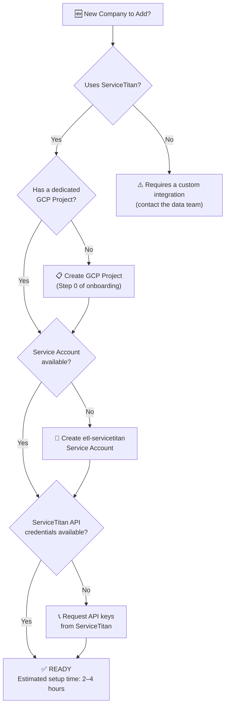

# � New Company Onboarding Guide
## Platform Partners — Adding a New Company to the Data Platform

> **Purpose:** This guide covers the end-to-end process for integrating a new company into the Data Platform. Since the platform is multi-tenant by design, each new company in the portfolio gets its own fully isolated and standardized environment — in hours, not months.

---

## Step 1: Is the New Company Ready?

Before starting, verify the following prerequisites.



---

## Step 2: Supported Company Types

The platform supports any company within the portfolio that operates on ServiceTitan.

| Service Type | Compatible? | Notes |
|---|---|---|
| 🛠️ HVAC | ✅ Yes | Full native support |
| 🔧 Plumbing | ✅ Yes | Full native support |
| ⚡ Electrical | ✅ Yes | Full native support |
| 🌿 Landscaping | ✅ Yes | Minor job type config needed |
| 🐛 Pest Control | ✅ Yes | Recurring job patterns apply |
| 🏗️ General Contracting | ⚠️ Partial | Estimates-heavy, data team review required |

---

## Step 3: Onboarding Checklist

### Phase 0 — Prerequisites
```
[ ] GCP Project created for the new company
[ ] Project ID and Project Number documented
[ ] Billing account linked
[ ] ServiceTitan API credentials collected:
    - app_id
    - client_id
    - client_secret
    - tenant_id
    - app_key
```

---

### Phase 1 — Infrastructure Setup (~30 min)

#### 1.1 — Create BigQuery Datasets
```bash
python gcloud_automation/create_bigquery_datasets.py \
  --project NEW_COMPANY_PROJECT_ID \
  --datasets bronze silver dashboards management
```

#### 1.2 — Create & Configure Service Account
```bash
bash gcloud_automation/iam/create_pro_service_account.sh \
  --project NEW_COMPANY_PROJECT_ID
```
Grants: `bigquery.admin`, `storage.admin`, `run.invoker`

#### 1.3 — Grant Access to Central Metadata
```bash
gcloud projects add-iam-policy-binding pph-central \
  --member="serviceAccount:etl-servicetitan@NEW_COMPANY_PROJECT_ID.iam.gserviceaccount.com" \
  --role="roles/bigquery.dataViewer"
```

---

### Phase 2 — ETL Deployment (~45 min)

#### 2.1 — Register the Company in the Metadata Registry
```sql
INSERT INTO `pph-central.management.metadata_consolidated_tables`
  (project_id, company_name, active, silver_use_bronze, endpoint, table_name)
VALUES
  ('NEW_COMPANY_PROJECT_ID', 'Company Name', TRUE, TRUE,
   STRUCT('settings', 'v2', NULL, 'technicians', 'normal'), 'technician')
  -- ... repeat for each endpoint
```
> **Tip:** Use an existing company entry as a template.

#### 2.2 — Deploy ETL Jobs
```bash
gcloud config set project NEW_COMPANY_PROJECT_ID

cd etl_servicetitan/st2json-job && ./build_deploy.sh pro
cd ../json2bq-job && ./build_deploy.sh pro
```

#### 2.3 — Register ServiceTitan Credentials
```bash
gcloud run jobs update etl-st2json-job \
  --project NEW_COMPANY_PROJECT_ID \
  --region us-east1 \
  --set-env-vars "ST_APP_ID=...,ST_CLIENT_ID=...,ST_TENANT_ID=..."
```

#### 2.4 — Configure the Scheduler
```bash
gcloud scheduler jobs create http etl-NEW_COMPANY-schedule \
  --location=us-east1 \
  --project NEW_COMPANY_PROJECT_ID \
  --schedule="0 */6 * * *" \
  --uri="ORCHESTRATOR_FUNCTION_URL" \
  --http-method=POST
```

---

### Phase 3 — Analytics Setup (~30 min)

#### 3.1 — Add to Dataform Config
In `ltm_migration/dataform/includes/config_loader.js`:
```javascript
const ACTIVE_COMPANIES = [
  // ... existing companies ...
  {
    project: "NEW_COMPANY_PROJECT_ID",
    name: "Company Name",
    datasets: { raw: "bronze", silver: "silver", dashboards: "dashboards" }
  }
];
```

#### 3.2 — Run Dataform
```bash
dataform run --project NEW_COMPANY_PROJECT_ID
```

#### 3.3 — Connect Google Sheets
For each report (LTM, PULSE, Daily Tracker):
1. Open the report template Google Sheet
2. **Data → Connected Sheets** → point to `NEW_COMPANY_PROJECT_ID.dashboards.vw_[report]`
3. Set refresh schedule to daily

---

### Phase 4 — Validation (~30 min)

```bash
# Verify Bronze data is flowing
bq query --nouse_legacy_sql \
  "SELECT COUNT(*) as records, MAX(_etl_synced) as last_sync
   FROM \`NEW_COMPANY_PROJECT_ID.bronze.technician\`"

# Verify Silver views
bq query --nouse_legacy_sql \
  "SELECT COUNT(*) FROM \`NEW_COMPANY_PROJECT_ID.silver.vw_dailytracker_timestamp_base\`"

# Verify Dashboards
bq ls --project_id=NEW_COMPANY_PROJECT_ID dashboards
```

---

## Estimated Total Time

```mermaid
gantt
    title New Company Onboarding — Timeline
    dateFormat HH:mm
    axisFormat %H:%M

    section Phase 0 (Prerequisites)
    Credential gathering & GCP setup  :a1, 00:00, 30m

    section Phase 1 (Infrastructure)
    Datasets & service accounts       :a2, after a1, 30m

    section Phase 2 (ETL)
    Register metadata & deploy jobs   :a3, after a2, 45m

    section Phase 3 (Analytics)
    Dataform & Sheets setup           :a4, after a3, 30m

    section Phase 4 (Validation)
    End-to-end testing                :a5, after a4, 30m
```



**Total: 2–4 hours** for a team member familiar with the platform.

---

*Platform Partners — Data Intelligence Platform | March 2026*
